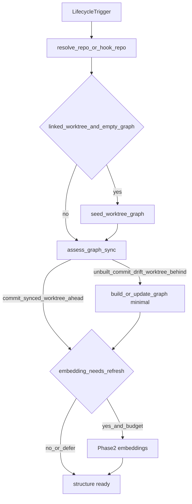

# Session / worktree graph freshness

<!-- constrained-by ./USAGE.md -->
<!-- constrained-by ./COMMANDS.md -->
<!-- derived-from ./RECIPES.md#single-repo-watch--session-prepare -->

How dagayn keeps the knowledge graph **structurally ready** before an agent
starts work across session start/resume, worktree create/switch/delete, HEAD
moves, Subagent/parallel-agent launch, and MCP first-tool calls.

## Ready-to-work definition

<!-- derived-from #use-case-catalog -->

| Layer | Ready when | Not ready when |
| ----- | ---------- | -------------- |
| **Structure** (required) | `is_structure_ready(sync)` — state is `commit_synced`, `worktree_behind`, or `worktree_ahead` (HEAD matches `git_head_sha`) | `unbuilt` or `commit_drift` |
| **Worktree** | Linked worktree seeded (if needed) and catch-up so `git_head_sha` matches that worktree's HEAD | Graph missing, still describing main, or HEAD drifted |
| **Embeddings** (best-effort) | Indexed when serve/install embedding mode is on | `pending` / `skipped_budget` — structure may still be ready; finish via MCP `ensure_graph_tool` / `get_minimal_context_tool` |

`worktree_behind` / `worktree_ahead` both mean uncommitted edits exist on a
HEAD-aligned graph, and both are **structure-ready** for analysis. They differ
in whether those edits are in the graph yet: session-start / explicit
`session prepare` indexes the `worktree_behind` ones once
(`needs_structure_prepare`), and skips `worktree_ahead` entirely because an
edit hook already indexed them. MCP `get_minimal_context(auto_prepare=True)`
only bootstraps on `unbuilt` / `commit_drift` (`needs_mcp_auto_prepare`) so a
dirty tree does not re-prepare on every tool call; ongoing dirty indexing is
UC-E1 (`update --skip-flows`).

`session_prepare` / `ensure_graph` may return `status=partial` when the wall-clock
budget or a hook lock leaves structure **not** ready (`unbuilt` / `commit_drift`), or
when embeddings stay deferred while structure is ready. Callers must retry
(UC-M2) before treating a non-ready structure as ready. Guarantee tests require
`status == "ok"` **and** `is_structure_ready(sync)` after a successful prepare.

`build_if_missing` is accepted by `session_prepare` / `ensure_graph` for API
symmetry with `dagayn worktree sync`; the prepare path currently always builds
an empty graph when structure prepare runs — do not rely on that flag as a
gate.

`dagayn serve` only runs `ensure_worktree_graph` (seed). Catch-up still requires
`session prepare` / `worktree sync` / MCP auto_prepare (UC-A1).

## Sync state model

<!-- constrained-by ./COMMANDS.md#git-worktrees -->

Authority: `GraphSyncState` in `dagayn/state_types.py` (a Pydantic
discriminated union on `state`) plus `assess_graph_sync` / `sync_state` /
`is_structure_ready` / `needs_structure_prepare` / `needs_mcp_auto_prepare` in
`dagayn/tools/sync_status.py`.

Freshness is decided in two tiers. The **commit tier** compares the graph's
stored `git_head_sha` with HEAD. The **diff tier** applies only once the commit
tier agrees, and compares the graph's indexed file content (`nodes.file_hash` /
`nodes.mtime_ns`) with what is on disk.

| `sync.state` | Tier | Meaning | Structure ready? |
| ------------ | ---- | ------- | ---------------- |
| `unbuilt` | — | No nodes/files in the graph | No |
| `commit_drift` | commit | Stored `git_head_sha` ≠ HEAD (or missing metadata / undated graph) — degraded | No |
| `commit_synced` | commit + diff | HEAD match, clean worktree, every indexed file still matches its stored hash — stable | Yes |
| `worktree_behind` | diff | HEAD match, but the graph does not have `pending_files` as they are on disk — outdated | Yes |
| `worktree_ahead` | diff | HEAD match, dirty tree, and every dirty file is already indexed byte for byte | Yes |

The diff tier checks **every indexed file**, not only the files git calls dirty.
A graph can hold content that no longer exists — an edit hook indexes an
uncommitted change and the change is then discarded with `git checkout --` —
which leaves HEAD matching and the tree clean, so neither the commit tier nor a
dirty-only check would notice. That case is `worktree_behind` with
`worktree_dirty: false`.

Verification is a `stat`-only first pass (a rewritten file always moves its
mtime) and hashes bytes only for files whose mtime moved; on this repository the
whole diff tier costs ~5 ms against ~90 ms of git subprocess calls in the same
assessment. Dirty files go through the incremental pipeline's own filters
(`_filter_incremental_candidates` / `_classify_python_changed_files`), so a file
dagayn would never parse — ignored, binary, unsupported language — cannot pin
the state to `worktree_behind`.

The cap on that second pass is `max_hash_candidates` (default 200 for read-path
callers). Above it verification is abandoned and the dirty-only answer stands —
a freshly seeded worktree has stored mtimes from the main checkout, and
re-hashing the tree on every assessment would cost more than the state is worth.
The assessment then reports `content_verified: false` plus
`unverified_file_count`, because a fresh checkout of any real repository lands
here and `commit_synced` would otherwise mean "git reports a clean tree" while
implying "the graph's content was checked against it". Session prepare passes
`max_hash_candidates=None` to verify everything: it is the caller that can
afford the cost and is about to re-index anyway.

`pending_files` is fed back into the update as `extra_files`
(`incremental_update`). Without that the state is a fixed point its own
prescribed action cannot leave: a file whose on-disk bytes equal the diff base
cannot appear in `git diff`, so prepare re-ran every session, reported
"No changes detected", and the graph kept serving the wrong content.

Session / explicit prepare runs when `needs_structure_prepare` is true
(`unbuilt` / `commit_drift` / `worktree_behind`, or `force=True`) — notably
**not** `worktree_ahead`, whose edits the graph already has. MCP auto_prepare
runs when `needs_mcp_auto_prepare` is true (`unbuilt` / `commit_drift`, or
force).

Assessments also carry a legacy 4-value `status`
(`empty` / `git_drift` / `dirty_worktree` / `synced`) for MCP clients and hook
scripts written before `state` existed; both dirty states map onto
`dirty_worktree`. `sync_state()` accepts either shape, degrading a legacy
`dirty_worktree` to the conservative `worktree_behind`.

## Which triggers may claim "the graph describes HEAD"

<!-- constrained-by ./COMMANDS.md#git-worktrees -->

`git_head_sha` is what the commit tier reads, so only an update that actually
covered the gap may write it. `incremental_update` stamps it when
`_diff_covers_graph_commit` holds — the diff base resolves to the exact commit
the graph was built at (`git diff` compares trees, so that base yields the
complete file-level delta), or the graph has no stored commit at all.

| Trigger | Diff base | Stamps HEAD? |
| ------- | --------- | ------------ |
| `dagayn build` (full) | whole tree | Yes |
| `dagayn update` | stored `git_head_sha`, else `HEAD~1` | Yes, unless `--base` is narrower than the graph's commit |
| `dagayn session prepare` | seeded `base_sha` → stored `git_head_sha` → `HEAD~1` | Yes |
| `dagayn worktree sync` | `--base` → seeded `base_sha` → stored `git_head_sha` → `HEAD~1` | Yes |
| `dagayn watch` / daemon watchers | explicit changed files | No — file-level coverage only |
| `seed_worktree_graph` | none (copy) | Keeps the source graph's commit |

An update whose base fell short leaves the stored commit alone, so the state
stays `commit_drift` and the next prepare catches up. Before this contract
existed, `dagayn update` defaulted to `HEAD~1` and stamped HEAD regardless: an
edit hook firing after a multi-commit `git pull` indexed the last commit only,
then reported the graph as synced with the intervening files silently missing.

## Derived tables across a re-parse

Flows, community assignments, and the risk index are keyed on `nodes.id`, and
re-parsing a file deletes its nodes and inserts new ones with new autoincrement
ids. Flow and community detection only runs at `postprocess=full`, which no hook
uses — every hook and `session prepare` run at `minimal` — so the derived rows
would otherwise be left pointing at nodes that no longer exist, and `flow_tool`
would keep serving flows whose entire path was deleted commits ago.

Two guards keep that from happening:

* the file-replacement paths (`remove_file_data` / `remove_files_data`) drop the
  node-keyed rows for that file before its nodes go;
* `minimal` post-processing runs a repository-wide sweep
  (`prune_orphaned_graph_structures`) for rows orphaned by a path that bypasses
  the Python store, such as the Rust backend, reporting counts as
  `orphans_pruned`.

Pruning leaves the graph honest rather than complete: after a rebuild at
`minimal`, flows and communities are *absent*, not stale, and
`graph_health` / answerability reports the gap. Run `dagayn postprocess` (or
`dagayn build` without `--skip-flows`) to recompute them. `minimal` runs also
record `postprocess_level` now, so a graph cannot claim a level it never got.

## Lifecycle flow

## Use-case catalog

| ID | Trigger | Entry point | Freshness guarantee |
| -- | ------- | ----------- | ------------------- |
| UC-S1 | Session start | Cursor `sessionStart` / Claude `SessionStart` / OpenCode `session.created` → `dagayn session prepare` | Structure refresh if needed; hook budget 45s |
| UC-S2 | Session resume | Same hooks (no dedicated resume event) | Re-assess dirty/drift; same prepare path. `worktree_ahead` is a noop |
| UC-H1 | HEAD relocate mid-session | Cursor `crg-relocate.sh` / OpenCode after HEAD-moving git → `session prepare` | `commit_drift` → structure refresh |
| UC-W1 | Worktree create | Cursor `.cursor/worktrees.json` setup / Claude `EnterWorktree` / `worktree sync` / `session prepare` | Seed from main + catch-up to worktree HEAD |
| UC-W2 | Worktree switch / re-enter | EnterWorktree / `session prepare` in existing worktree | Seed skipped if graph exists; catch-up from stored `git_head_sha` |
| UC-W3 | Worktree delete | `git worktree remove` (no dagayn hook) | Main checkout graph unchanged; orphaned worktree `.dagayn` discarded with the tree |
| UC-A1 | Subagent / parallel agent | Worktree create + MCP in that tree | Seed alone is not enough; `get_minimal_context(auto_prepare=True)` or `session prepare` catch-up → structure ready |
| UC-M1 | MCP first tool | `get_minimal_context_tool` | `auto_prepare` on `unbuilt`/`commit_drift` (300s); dirty does not loop |
| UC-M2 | MCP explicit sync | `ensure_graph_tool` | Same prepare path with MCP budget; retry after `partial` until structure ready |
| UC-E1 | File edit (ongoing) | `dagayn update --skip-flows` | Out of bootstrap scope — keeps graph current during a session, not a start gate |

Platform notes: Codex installs without the Claude `EnterWorktree` matcher
(`worktree_hook=False`). Cursor/Claude/OpenCode cover UC-W1 enter hooks;
Codex relies on MCP auto_prepare / manual `worktree sync` in the worktree.

Automated coverage lives in `tests/test_session_graph_freshness.py` (test names
carry the UC id), including hook-wiring asserts for Cursor/Claude/OpenCode.

## Out of scope

- Spawning real Cursor/Claude Subagents in CI
- Treating embedding sidecar health as a readiness gate
- A dedicated worktree-delete cleanup hook
- Changing the unused `build_if_missing` gate inside `session_prepare`
