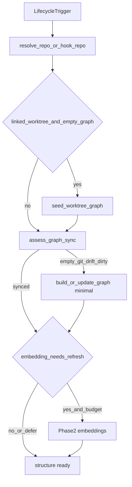

# Session / worktree graph freshness

<!-- constrained-by ./USAGE.md -->
<!-- constrained-by ./COMMANDS.md -->
<!-- derived-from ./RECIPES.md#single-repo-watch--session-prepare -->

How dagayn keeps the knowledge graph **structurally ready** before an agent
starts work across session start/resume, worktree create/switch/delete, HEAD
moves, Subagent/parallel-agent launch, and MCP first-tool calls.

## Ready-to-work definition

<!-- derived-from #use-case-catalog -->

| Layer | Ready when | Not ready when |
| ----- | ---------- | -------------- |
| **Structure** (required) | `is_structure_ready(sync)` — status is `synced` **or** `dirty_worktree` (HEAD matches `git_head_sha`) | `empty` or `git_drift` |
| **Worktree** | Linked worktree seeded (if needed) and catch-up so `git_head_sha` matches that worktree's HEAD | Graph missing, still describing main, or HEAD drifted |
| **Embeddings** (best-effort) | Indexed when serve/install embedding mode is on | `pending` / `skipped_budget` — structure may still be ready; finish via MCP `ensure_graph_tool` / `get_minimal_context_tool` |

`dirty_worktree` means uncommitted edits exist on a HEAD-aligned graph. It is
**structure-ready** for analysis. Session-start / explicit `session prepare`
still indexes dirty files once (`needs_structure_prepare`). MCP
`get_minimal_context(auto_prepare=True)` only bootstraps on `empty` /
`git_drift` (`needs_mcp_auto_prepare`) so a dirty tree does not re-prepare on
every tool call; ongoing dirty indexing is UC-E1 (`update --skip-flows`).

`session_prepare` / `ensure_graph` may return `status=partial` when the wall-clock
budget or a hook lock leaves structure **not** ready (`empty` / `git_drift`), or
when embeddings stay deferred while structure is ready. Callers must retry
(UC-M2) before treating a non-ready structure as ready. Guarantee tests require
`status == "ok"` **and** `is_structure_ready(sync)` after a successful prepare.

`build_if_missing` is accepted by `session_prepare` / `ensure_graph` for API
symmetry with `dagayn worktree sync`; the prepare path currently always builds
an empty graph when structure prepare runs — do not rely on that flag as a
gate.

`dagayn serve` only runs `ensure_worktree_graph` (seed). Catch-up still requires
`session prepare` / `worktree sync` / MCP auto_prepare (UC-A1).

## Sync status model

<!-- constrained-by ./COMMANDS.md#git-worktrees -->

Authority: `assess_graph_sync` / `is_structure_ready` /
`needs_structure_prepare` / `needs_mcp_auto_prepare` in
`dagayn/tools/sync_status.py`.

| `sync.status` | Meaning | Structure ready? |
| ------------- | ------- | ---------------- |
| `empty` | No nodes/files in the graph | No |
| `git_drift` | Stored `git_head_sha` ≠ current HEAD (or missing metadata) | No |
| `dirty_worktree` | HEAD matches but staged/unstaged/untracked files exist | Yes |
| `synced` | Non-empty graph, HEAD match, clean worktree relative to HEAD | Yes |

Session / explicit prepare runs when `needs_structure_prepare` is true
(`empty` / `git_drift` / `dirty_worktree`, or `force=True`). MCP auto_prepare
runs when `needs_mcp_auto_prepare` is true (`empty` / `git_drift`, or force).

## Lifecycle flow

## Use-case catalog

| ID | Trigger | Entry point | Freshness guarantee |
| -- | ------- | ----------- | ------------------- |
| UC-S1 | Session start | Cursor `sessionStart` / Claude `SessionStart` / OpenCode `session.created` → `dagayn session prepare` | Structure refresh if needed; hook budget 45s |
| UC-S2 | Session resume | Same hooks (no dedicated resume event) | Re-assess dirty/drift; same prepare path |
| UC-H1 | HEAD relocate mid-session | Cursor `crg-relocate.sh` / OpenCode after HEAD-moving git → `session prepare` | `git_drift` → structure refresh |
| UC-W1 | Worktree create | Cursor `.cursor/worktrees.json` setup / Claude `EnterWorktree` / `worktree sync` / `session prepare` | Seed from main + catch-up to worktree HEAD |
| UC-W2 | Worktree switch / re-enter | EnterWorktree / `session prepare` in existing worktree | Seed skipped if graph exists; catch-up from stored `git_head_sha` |
| UC-W3 | Worktree delete | `git worktree remove` (no dagayn hook) | Main checkout graph unchanged; orphaned worktree `.dagayn` discarded with the tree |
| UC-A1 | Subagent / parallel agent | Worktree create + MCP in that tree | Seed alone is not enough; `get_minimal_context(auto_prepare=True)` or `session prepare` catch-up → structure ready |
| UC-M1 | MCP first tool | `get_minimal_context_tool` | `auto_prepare` on `empty`/`git_drift` (300s); dirty does not loop |
| UC-M2 | MCP explicit sync | `ensure_graph_tool` | Same prepare path with MCP budget; retry after `partial` until structure ready |
| UC-E1 | File edit (ongoing) | `dagayn update --skip-flows` | Out of bootstrap scope — keeps graph current during a session, not a start gate |

Platform notes: Codex installs without the Claude `EnterWorktree` matcher
(`worktree_hook=False`). Cursor/Claude/OpenCode cover UC-W1 enter hooks;
Codex relies on MCP auto_prepare / manual `worktree sync` in the worktree.

Automated coverage lives in `tests/test_session_graph_freshness.py` (test names
carry the UC id), including hook-wiring asserts for Cursor/Claude/OpenCode.

## Out of scope

- Spawning real Cursor/Claude Subagents in CI
- Treating embedding sidecar health as a readiness gate
- A dedicated worktree-delete cleanup hook
- Changing the unused `build_if_missing` gate inside `session_prepare`
